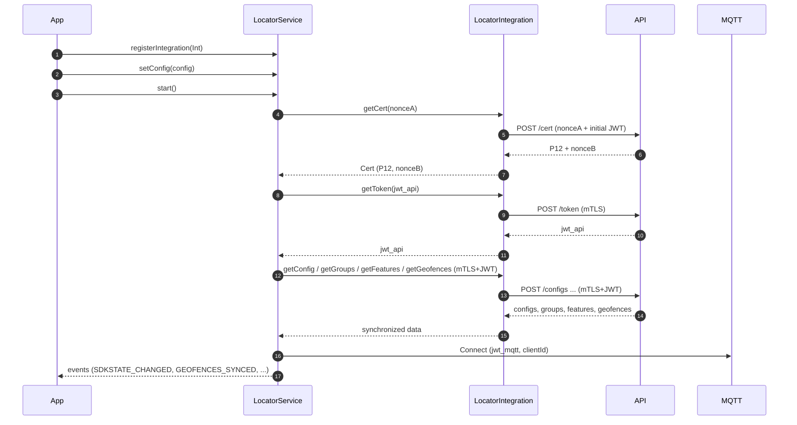

# SDK Architecture

[< Back](../README.md)

The Locator SDK architecture is composed of five main layers:

1. **APP** (your application)
2. **Public SDK** (`LocatorService`)
3. **Integration** (implemented by APP: `LocatorIntegration`)
4. **Internal Core** (collection, offline queue, retry, events)
5. **Transport** (HTTP/mTLS + MQTT + WSS)

### Offline queue and backoff

- **Offline queue**: stores collections and events when offline; respects `offlineRetentionDays` and `maxBatchSize`.
- **Retry**: policy configures `maxRetries`, `baseDelayMs`, `backoffFactor`.  
  Formula: `delay = baseDelayMs × backoffFactor^(attempt-1)`.
- **Consistency**: each package (`LocatorPackage`) has `id` and `sequence` for idempotency.

### States and modes

- `LocatorState`: `DEFAULT`, `IDLE`, `COLLECTING`, `PAUSED`, `STOPPED`
- `LocatorSdkMode`: `DEFAULT`, `OBSERVED`, `SOS`, `ALERT`

The **mode** adjusts collection and send intervals; the **state** describes the operational stage.

### Networks and connectivity

- `connectivity`: macro (wifi, cellular, bluetooth, ethernet, vpn, none)
- `network`: detailed (wifi6, 4g_lte, 5g_nsa, bt_le, etc.)

### Events and commands

- Events (`LocatorEvent`): system telemetry, errors, state changes.
- Commands (`LocatorCommand`): instructions from backend/app to SDK (e.g., `SET_SDK_MODE`, `SYNC_CONFIG`).

[< Back](../README.md)

