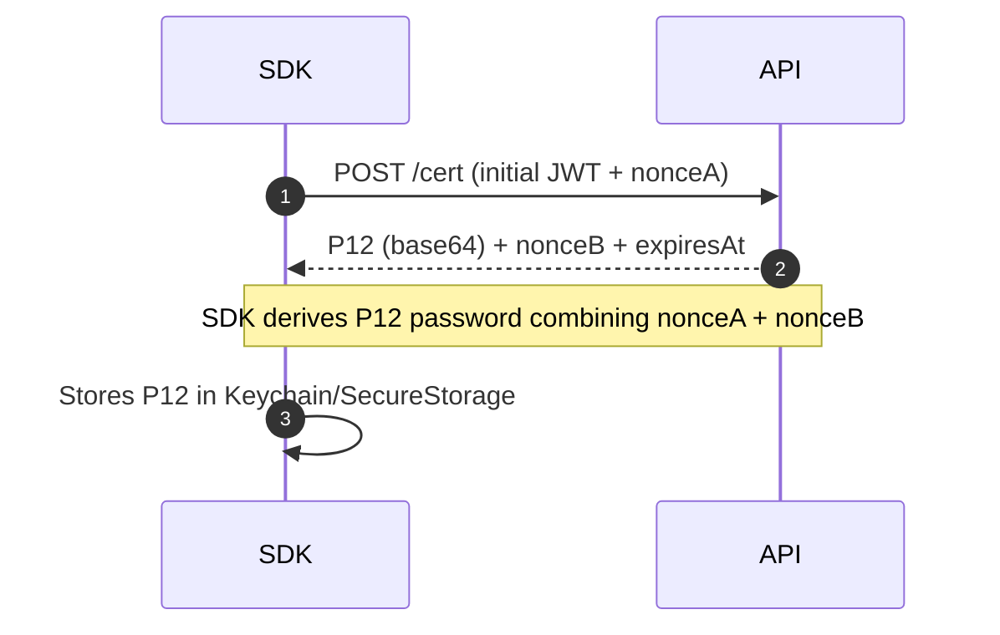

# SDK Authentication

[< Back](../README.md)

Locator SDK security combines **client certificates** (mTLS) and temporary **JWT tokens**.

## Certificate flow (mTLS)

- The `/cert` endpoint does **not** require mTLS (bootstrap).
- All other endpoints **require** mTLS **and** valid `jwt_api`.

## Tokens

- `jwt_api`: protected HTTP calls
- `jwt_mqtt`: MQTT session
- `jwt_wss`: secure WebSocket session

The SDK manages expiration and automatic renewal using `LocatorIntegration.getToken()`.

## MQTT

Authenticate with jwt_mqtt (automatic renewal by SDK).
Unique clientId per connection (SDK vs WSS).
Recommendations:
Conservative QoS (0/1 according to tolerated duplication needs).
Reconnect with backoff and jitter.
Topics: follow fixed product rule (illustrative example):
locator/{license}/telemetry (publish) • locator/{license}/commands (subscribe)

[< Back](../README.md)

