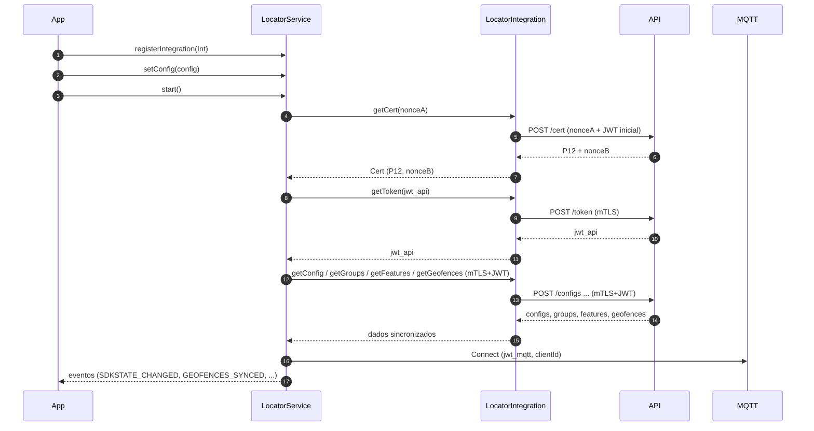

# Arquitetura SDK

[< Voltar](../README.md)

A arquitetura do Locator SDK é composta por cinco camadas principais:

1. **APP** (sua aplicação)
2. **SDK público** (`LocatorService`)
3. **Integração** (implementada pelo APP: `LocatorIntegration`)
4. **Core interno** (coleta, fila offline, retry, eventos)
5. **Transporte** (HTTP/MTLS + MQTT + WSS)

### Fila offline e backoff

- **Fila offline**: armazena coletagens e eventos quando sem rede; respeita `offlineRetentionDays` e `maxBatchSize`.
- **Retry**: política configura `maxRetries`, `baseDelayMs`, `backoffFactor`.  
  Fórmula: `delay = baseDelayMs × backoffFactor^(tentativa-1)`.
- **Consistência**: cada pacote (`LocatorPackage`) tem `id` e `sequence` para idempotência.

### Estados e modos

- `LocatorState`: `DEFAULT`, `IDLE`, `COLLECTING`, `PAUSED`, `STOPPED`
- `LocatorSdkMode`: `DEFAULT`, `OBSERVED`, `SOS`, `ALERT`

O **modo** ajusta intervalos de coleta e envio; o **estado** descreve o estágio operacional.

### Redes e conectividade

- `connectivity`: macro (wifi, cellular, bluetooth, ethernet, vpn, none)
- `network`: detalhado (wifi6, 4g_lte, 5g_nsa, bt_le, etc.)

### Eventos e comandos

- Eventos (`LocatorEvent`): telemetria de sistema, erros, mudanças de estado.
- Comandos (`LocatorCommand`): instruções do backend/app para o SDK (ex.: `SET_SDK_MODE`, `SYNC_CONFIG`).

[< Voltar](../README.md)
