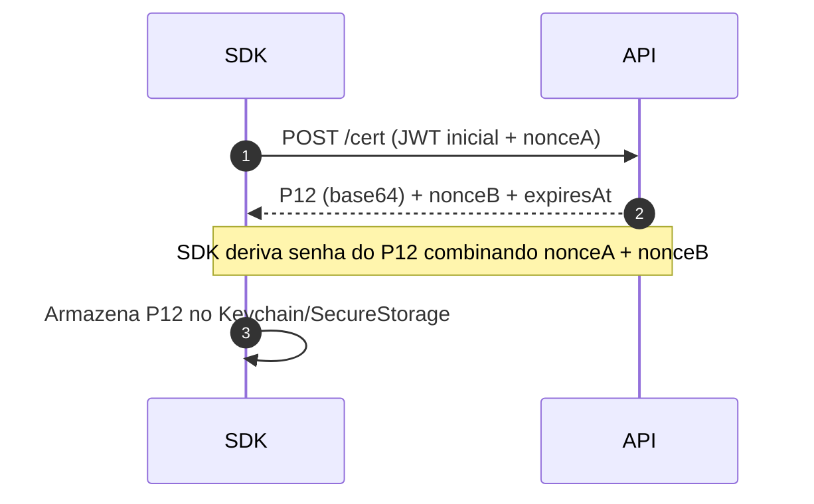

# Autenticação SDK

[< Voltar](../README.md)

A segurança do Locator SDK combina **certificados cliente** (mTLS) e **tokens JWT** temporários.

## Fluxo de certificado (mTLS)

- O endpoint `/cert` **não** exige mTLS (bootstrap).
- Os demais endpoints **exigem** mTLS **e** `jwt_api` válido.

## Tokens

- `jwt_api`: chamadas HTTP protegidas
- `jwt_mqtt`: sessão MQTT
- `jwt_wss`: sessão WebSocket segura

O SDK gerencia expiração e renovação automática, usando `LocatorIntegration.getToken()`.

## MQTT

Autenticar com jwt_mqtt (renovação automática pelo SDK).
clientId único por conexão (SDK vs WSS).
Recomendações:
QoS conservador (0/1 conforme necessidade de duplicação tolerada).
Reconectar com backoff e jitter.
Tópicos: seguem regra fixa do produto (exemplo ilustrativo):
locator/{license}/telemetry (publish) • locator/{license}/commands (subscribe)

[< Voltar](../README.md)
